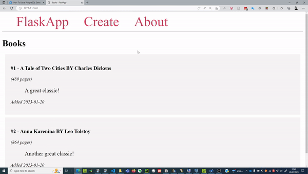

# Flask + Postgres

Tiny setup showing Flask + Postgres database



Link to tutorial followed [link](https://www.digitalocean.com/community/tutorials/how-to-use-a-postgresql-database-in-a-flask-application)

## Setup

```
conda create --name flask-postgres python==3.9 -y
conda activate flask-postgres
pip install poetry
poetry config virtualenvs.create false
poetry install
```

Workaround for insufficient privileges

```
CREATE ROLE dbowner NOLOGIN;
ALTER DATABASE flask_db OWNER TO dbowner;
GRANT dbowner TO sammy;
```

`.env` contents

```
DB_USERNAME=sammy
DB_PASSWORD= ... (see tutorial)
FLASK_APP=app
FLASK_DEBUG=TRUE
```